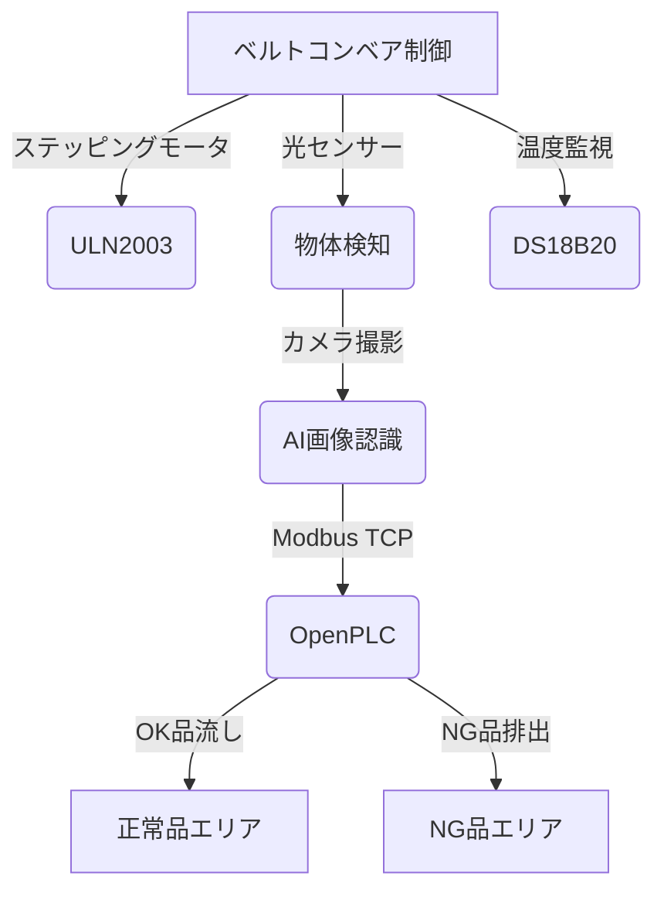

# 設計書

## 1. 背景と目的

本設計書は、Raspberry Pi 5を用いたLEGOベルトコンベアシステムの詳細設計をまとめたものである。ステッピングモータ、サーボモータ、AI画像認識、温度センサーを組み合わせ、NG品を自動排出するシステムを構築することを目的とする。

### システム全体のデータフロー

1. ベルトコンベアが28BYJ-48ステッピングモータで駆動。
2. 光センサー（CdSセル）が物体を検知するとベルトコンベアを一旦停止。
3. コンベア上の物体をカメラが撮影。
4. Raspberry Pi上のAIが画像認識で物体のOK/NGを判定。
5. AIが判定結果をOpenPLCへModbus TCP通信で送信。
6. AI判定結果がOpenPLCに送信されると、ベルトコンベアを再開。
7. 再開後、物体がFS90サーボの位置まで移動したら、OpenPLCがFS90サーボを制御し、NG品を排出。
8. 温度センサーがモータ温度を監視、異常温度時はモータを停止。

### システムアーキテクチャ

## 2. 機能要件

### 2.1 ベルトコンベア制御
- ステッピングモータを使用し、一定速度でベルトコンベアを駆動する
- 物体を検知した場合、一時停止しカメラ撮影を行う
- AI画像認識の判定結果に応じて、NG品を排出
- 速度制御機能を搭載し、適切な搬送速度を調整可能にする
- 光センサー（CdSセル）と白色LEDを使用して物体検知

### 2.2 AI画像認識
- カメラで物体を撮影し、TensorFlow Liteを用いてOK/NG判定を実施
- AI判定結果をModbus TCPを介してOpenPLCに送信

### 2.3 サーボモータ制御
- FS90サーボモータを使用し、NG品を90度回転で排出
- OpenPLCの指示に基づき、適切なタイミングで作動

### 2.4 温度監視システム
- DS18B20温度センサーを使用し、モータの温度を定期的に監視
- 50℃を超えた場合にOpenPLCへ通知し、モータを停止

### 2.5 通信制御（Python & Modbus TCP）

- Raspberry Pi 5とOpenPLC間でModbus TCPによる通信を行い、制御指示を受信
- 各コンポーネントの状態（温度、モータ動作状況など）をOpenPLCに送信
- AD変換モジュール（MCP3008）を使用し、光センサー（CdSセル）を処理
- OpenPLCからModbus TCP経由でモータ速度を指定するレジスタを使用
  - **レジスタ 40005**: モータ速度制御値（範囲: 0=停止, 100=最大速度）
  - Python側でこの値を読み取り、速度に応じてステッピングモータのステップ間隔を調整

### 2.6 レジスタ割当て

| レジスタ | 内容                                       |
| -------- | ------------------------------------------ |
| 40001    | AI判定結果（0=OK, 1=NG）                   |
| 40002    | 画像処理完了フラグ（0=未処理, 1=処理完了） |
| 40003    | モータ温度異常フラグ（0=正常, 1=異常）     |
| 40004    | 物体検知フラグ（0=未検知, 1=検知）         |

### Raspberry Pi 5 GPIO配線詳細

| Raspberry Pi 5 ピン  | 用途                                         |
| -------------------- | -------------------------------------------- |
| 3.3V (1pin)          | MCP3008電源・基準電圧供給(Vdd,Vref 16,15pin) |
| GND (6pin)           | MCP3008接地(AGND,DGND 14,9pin)               |
| GPIO11 (23pin, SCLK) | SPIクロック信号 (CLK 13pin)                  |
| GPIO9 (21pin, MISO)  | SPIデータ出力(MCP→RPi) (Dout 12pin)          |
| GPIO10 (19pin, MOSI) | SPIデータ入力(RPi→MCP) (Din 11pin)           |
| GPIO8 (24pin, CE0)   | SPIチップ選択信号 (CS 10pin)                 |
| GPIO4                | 温度センサー（DS18B20）データ                |
| GPIO17               | ULN2003 IN1(青)                              |
| GPIO27               | ULN2003 IN2(白)                              |
| GPIO22               | ULN2003 IN3(緑)                              |
| GPIO23               | ULN2003 IN4(黄)                              |
| GPIO13 (33pin, PWM1) | FS90サーボPWM信号                            |
| GPIO25               | 白色LED出力                                  |
| 5V                   | ULN2003 VCC & FS90 VCC                       |
| GND                  | 共通GND                                      |

### Raspberry Pi 5とMCP3008のピン配置

| Raspberry Pi 5 ピン   | MCP3008 ピン           | 用途                        |
| --------------------- | ---------------------- | --------------------------- |
| 3.3V (Pin 1)          | VDD, VREF (Pin 16, 15) | MCP3008の電源供給と基準電圧 |
| GND (Pin 6)           | AGND, DGND (Pin 14, 9) | MCP3008の接地               |
| GPIO11 (Pin 23, SCLK) | CLK (Pin 13)           | SPIクロック信号             |
| GPIO9 (Pin 21, MISO)  | DOUT (Pin 12)          | SPIデータ出力 (MCP → RPi)   |
| GPIO10 (Pin 19, MOSI) | DIN (Pin 11)           | SPIデータ入力 (RPi → MCP)   |
| GPIO8 (Pin 24, CE0)   | CS (Pin 10)            | SPIチップ選択信号           |

- Raspberry Pi 5とOpenPLC間でModbus TCPによる通信を行い、制御指示を受信
- 各コンポーネントの状態（温度、モータ動作状況など）をOpenPLCに送信
- AD変換モジュール（MCP3008）を使用し、光センサー（CdSセル）を処理
- OpenPLCからModbus TCP経由でモータ速度を指定するレジスタを使用
  - **レジスタ 40005**: モータ速度制御値（範囲: 0=停止, 100=最大速度）
  - Python側でこの値を読み取り、速度に応じてステッピングモータのステップ間隔を調整
- Raspberry Pi 5とOpenPLC間でModbus TCPによる通信を行い、制御指示を受信
- 各コンポーネントの状態（温度、モータ動作状況など）をOpenPLCに送信
- AD変換モジュール（MCP3008）を使用し、光センサー（CdSセル）を処理

### 2.6 参考資料
- [28BYJ-48 データシート (秋月電子)](https://akizukidenshi.com/goodsaffix/28byj-48.pdf)
- [28BYJ-48-W01 データシート (秋月電子)](https://akizukidenshi.com/goodsaffix/28BYJ48-W01.pdf)
- [ステッピングモータの駆動方式解説](https://creators-small-room.hatenablog.com/entry/steppingmotor-uni)

## 3. 非機能要件

- システムのリアルタイム性を確保（レスポンスタイム100ms以下）
- モータ、サーボの耐久性を考慮した運用設計
- 通信の信頼性（Modbus TCPの安定性）
- 運用管理の容易性（ソフトウェアのメンテナンス性）

## 4. 制約事項

- Raspberry Pi 5のGPIOを使用し、外部マイコンは利用しない
- OpenPLCを使用し、ラダー制御でステッピングモータ・サーボを管理
- 予算の都合上、既存のモジュール（MCP3008、ULN2003）を活用

## 5. ユースケース

### 5.1 ベルトコンベアの起動
1. Raspberry Pi 5がOpenPLCを介してステッピングモータを起動
2. 一定速度でベルトコンベアが駆動

### 5.2 物体の検知と撮影
1. 光センサー（CdSセル）が物体を検知
2. ベルトコンベアを一時停止
3. カメラで物体を撮影し、AIに画像を送信

### 5.3 AI判定とコンベア再開
1. AIが画像を解析し、OK/NGを判定
2. 判定結果がOpenPLCへ送信される
3. ベルトコンベアが再開し、NG品がFS90サーボの前へ移動

### 5.4 NG品の排出
1. OpenPLCがNG判定を受信
2. FS90サーボモータが90度回転し、NG品を排出
3. 初期位置へ戻る

### 5.5 温度異常監視
1. DS18B20温度センサーが5秒ごとに温度を計測
2. 50℃を超えた場合、OpenPLCへ異常フラグを送信し、モータを停止

